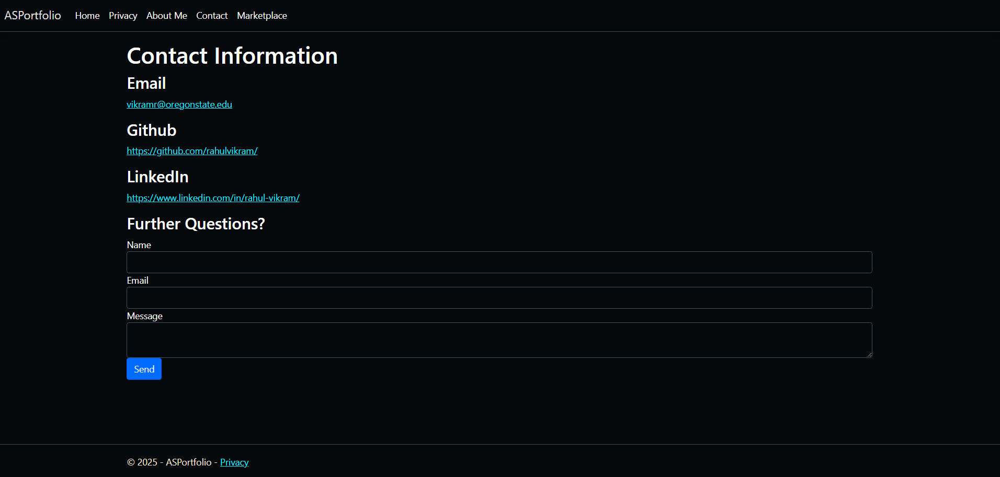
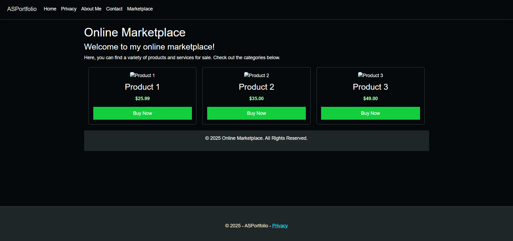

# ASPortfolio
### An example portfolio website and online marketplace using ASP.NET Core 3.1 and .NET 9.0!

This project makes use of many system design patterns, such as singleton, factory, repository, and dependency injection. It also uses the MVC design pattern to separate concerns and make the codebase more maintainable.

### Screenshots

]